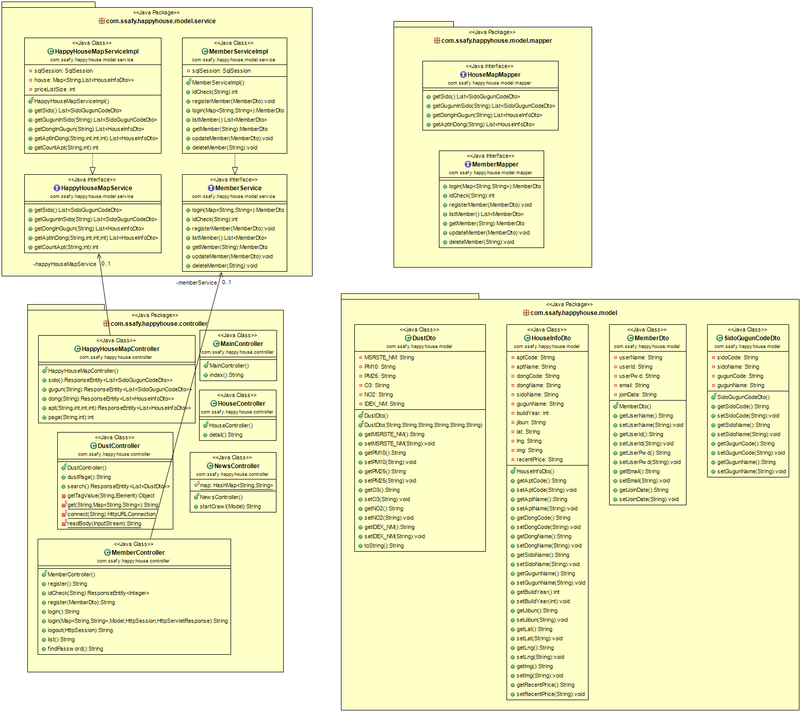
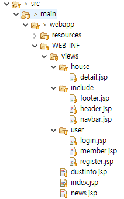
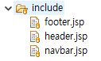
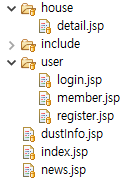
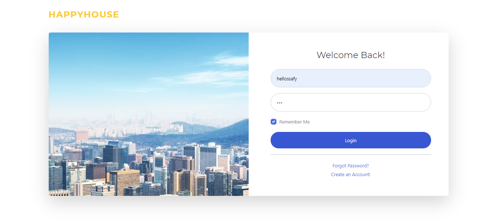
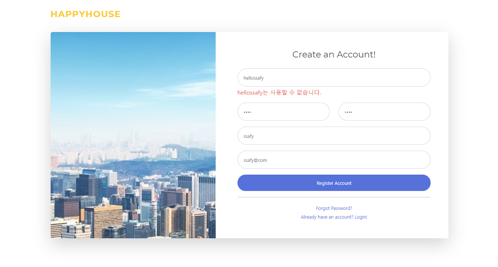
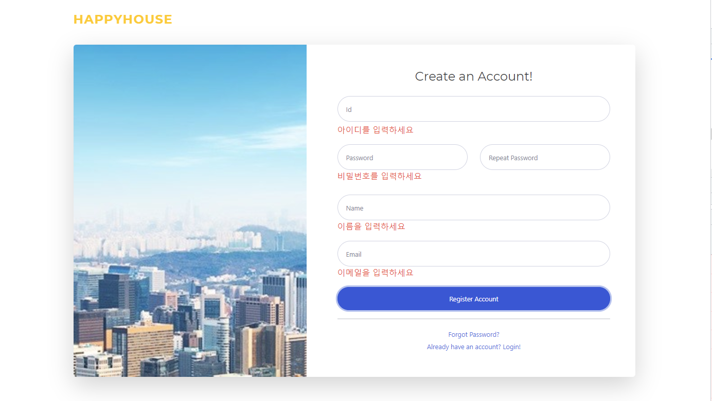
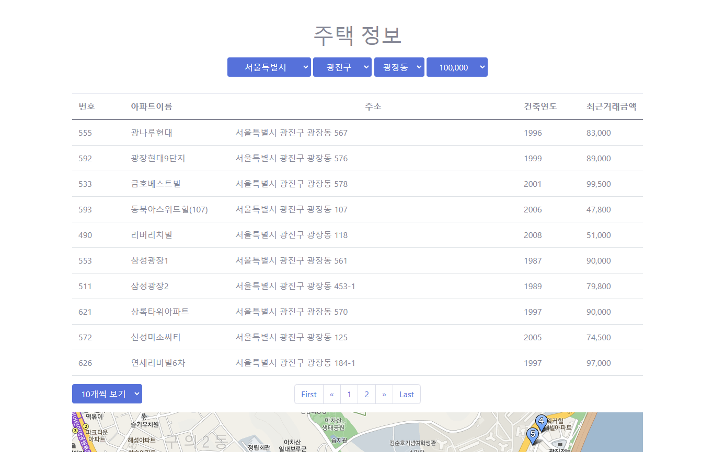

# pjt_daejeon_6th_class4_spring_team04

# 개발자
송예인, 김지언

# 기본 기능
+ ##### **주택 실거래가 정보 수집**
+ ##### **시/구/동 별 아파트 실거래가 검색 기능 구현**
+ ##### **회원 관리, 세션 관리 구현**

# 추가 기능
+ ##### **아파트 5/10/15/20/40/60 개씩 보여주는 페이징 기능 구현**
+ ##### **아파트 하한가 기준으로 금액 기반 필터링 기능 구현**

# 심화 기능
+ ##### **부동산 관련 실시간 뉴스기사 크롤링 하여 top10 기사,제목,관련링크 띄우기 구현**
+ ##### **서울시 구 별 미세먼지 데이터 시각화 구현**

# 알고리즘 요소
+ #### **1. 다익스트라 알고리즘을 이용한 키워드 기반 매물 추천**
    + 기능: 유저가 설정한 키워드(ex. 역세권, 편세권, 스세권· 맥세권) 기반으로 매물을 추천해 줄 수 있다.
    + 구현: 
        + 유저가 예를들어 역세권, 편세권 이렇게 2가지 키워드를 선택 
        + 유저가 선택한 동에 있는 매물에대해 모든 역까지의 거리, 모든 편의점 까지의 거리  계산
        + 매물과 모든 역, 모든 편의점을 정점으로 생각하고, 2에서 구한 거리를 간선이라고 생각. 다익스트라 알고리즘을 이용하여 매물로 부터 모든 정점까지의 최소 경로 비용을 계산
        + 3번을 모든 매물에 적용하여 가장 가까운 최상위 매물 3개만 추천 

* * *

+ #### **2.동적계획법을 이용한 회사와 매물 까지의 지름길 개수 알려주기**
    + 기능: 유저의 회사 위치에서 선택한 매물 까지 가장 빠르게 갈 수 있는 지름길을 추천해 줄 수 있다.
    + 구현: 
        + 유저의 위치 p1 = {ux,uy} 와 매물의 위치 p2 = {hx, hy} 가 좌표로 변경되어 주어질 수 있다고 가정
        + 일정길이(d) 기준으로 격자모양 형태로 분리시킨다. 그 중 큰 건물이 있거나, 공사중인 공간은 갈 수 없는 공간으로 표시한다.
        + 2차원 배열에 유저가 도달하는데 걸리는 시간을 기록한다. 이때 메모이제이션을 이용해 중복 계산을 줄일 수 있다.
        + 가장 빨리 도달하는 기록 3개를 저장하여 유저에게 지름길로 알려준다.

* * *

+ #### **3.삽입 정렬 알고리즘을 이용한 미세먼지 청결지역 알려주기**
    + 기능: 유저가 선택한 지역들을 미세먼지 평균 농도가 가장 낮은 지역부터 정렬하여 보여줄 수 있습니다. 정렬 알고리즘 중 최적의 경우(이미 정렬된 배열로 들어온 경우)시간 복잡도가 n 인 삽입정렬 알고리즘을 선택하였습니다.
    + 구현: 
        + 지역별 최근 한달 미세먼지 평균농도를 구해 배열에 저장합니다.
        + 배열의 각 원소를 key 로 생각하여 순차적으로 앞에서 부터 비교하여 알맞은 자리에 삽입합니다. 
        
        ```java
        static class Dust{
		int avgdust;
		String area;
		    Dust(int avgdust, String area){ 
				this.avgdust = avgdust;
				this.area = area;
		    }
        }
        public insertionSort(Dust dust[], int size){ //지역별 평균 미세먼지 농도와, 지역 개수가 매개변수로 들어옴
		    int i,j,key;
		    for(int i=0;i<size;i++) 
				key = dust[i].avgdust;
				j = i - 1;
				while(j>=0 && dust[i].avgdust>key){
						dust[j].avgdust= dust[i].avgdust;
						j--;
				}
				dust[j+1].avgdust = key;
		    }
        }

        ```
* * *

+ #### **4.페이징 처리(구현완료)**
    - 기능: 여러 주택 정보를 표시할 때 다양한 조건으로 페이징 처리
    - View
        - 해당 조건에 맞는 아파트 리스트를 먼저 구하고(findApt)
        - 구한 아파트 리스트도 페이징 처리(findPage)
        - 각 페이지네이션 번호를 클릭하면 전에 구해놓은 리스트에서 인덱스로 값만 얻어옴(DB 접근X)

    ```jsx
    function findApt(page, price){
                        console.log(page);
                        console.log(page*$('#unit').val());
                        $.get(root + "/map/apt"
                                ,{dong: $("#dong").val(), cnt: $('#unit').val(), start: (page-1)*$('#unit').val(), price: price}
                                ,function(data, status){
                                    console.log(data);
                                    $("tbody").empty();
                                    $.each(data, function(index, vo) {
                                        console.log(data);
                                        let str = `
                                            <tr>
                                                <td>`+vo.aptCode+`</td>
                                                <td>`+vo.aptName+`</td>
                                                <td>`+vo.sidoName+" "+vo.gugunName+" "+vo.dongName+ " "+vo.jibun+`</td>
                                                <td>`+vo.buildYear+`</td>
                                                <td>`+vo.recentPrice+`</td>
                                            </tr>
                                        `;
                                        $("tbody").append(str);
                                    });
                                    displayMarkers(data);
                                }
                                , "json"
                        );
                    }

    function findPage(unit){
                        $.get(root + "/map/page"
                                ,{dong: $("#dong").val(), price: $('#price').val()}
                                ,function(data, status){
                                    console.log(data);
                                    $("#pagination").empty();
                                    let str = `
                                        <li class="page-item"><a class="page-link">First</a></li>
                                        <li class="page-item"><a class="page-link"
                                            aria-label="Previous"> <span aria-hidden="true">&laquo;</span>
                                                <span class="sr-only">Previous</span>
                                        </a></li>
                                    `;
                                    let page = data/unit;
                                    if(data%unit > 0) page++;
                                    for(let i = 1; i <= page; i++){
                                        str += `
                                            <li class="page-item"><a class="page-link">`+i+`</a></li>
                                        `;
                                    }
                                        str += `
                                            <li class="page-item"><a class="page-link" aria-label="Next">
                                            <span aria-hidden="true">&raquo;</span> <span class="sr-only">Next</span>
                                    </a></li>
                                    <li class="page-item"><a class="page-link">Last</a></li>
                                        `;
                                    $("#pagination").append(str);
                                }
                                , "json"
                        );
                    }
    ```

    - Controller
        - @parameter
            - dong: 동코드
            - start: 시작 인덱스
            - cnt: 시작 인덱스로부터 가져올 개수
            - price: 가격 조건 (0일 때는 조건이 없는 경우)

    ```java
    @GetMapping("/apt")
        public ResponseEntity<List<HouseInfoDto>> apt(@RequestParam("dong") String dong,
                @RequestParam(value = "start", required = false, defaultValue = "0") int start,
                @RequestParam(value = "cnt", required = false, defaultValue = "5") int cnt,
                @RequestParam(value = "price", required = false, defaultValue = "0") int price) throws Exception {
            return new ResponseEntity<List<HouseInfoDto>>(happyHouseMapService.getAptInDong(dong, start, cnt, price),
                    HttpStatus.OK);
        }

        @GetMapping("/page")
        public int page(@RequestParam("dong") String dong,
                @RequestParam(value = "price", required = false, defaultValue = "0") int price) throws Exception {
            return happyHouseMapService.getCountApt(dong, price);
        }
    ```

    - Service
        - Map으로 이전에 구했던 동(dong)의 리스트는 다시 DB에 접근할 필요가 없이 값만 가져옴

    ```java
    private Map<String, List<HouseInfoDto>> house = new HashMap<String, List<HouseInfoDto>>();
    private int priceListSize = 0;

    @Override
        public List<HouseInfoDto> getAptInDong(String dong, int start, int cnt, int price) throws Exception {
            List<HouseInfoDto> list;
            
            if (!house.containsKey(dong)) {
                house.put(dong, sqlSession.getMapper(HouseMapMapper.class).getAptInDong(dong));
            }
            
            if (price != 0) { // 가격 조건이 있으면
                List<HouseInfoDto> priceList = new ArrayList<>(); // 가격으로 필터링한 리스트
                for (int i = 0; i < house.get(dong).size(); i++) {
                    // System.out.println("최신가격: " + house.get(dong).get(i).getRecentPrice());
                    if (house.get(dong).get(i).getRecentPrice() != null) { // null값 필터링
                        String[] st = house.get(dong).get(i).getRecentPrice().trim().split(",");
                        int p = Integer.parseInt(st[0] + st[1]);// 매물가격이고 기준가격이랑 비교해서 띄울지 말지 결정
                        if (p <= price) {
                            priceList.add(house.get(dong).get(i));
                        }
                    }
                }
                list = priceList;
                priceListSize = list.size();
            }else {
                list = house.get(dong);
            }

            if (cnt + start > list.size()) {
                return list.subList(start, list.size());
            }
            return list.subList(start, cnt + start);
        }

        @Override
        public int getCountApt(String dong, int price) throws Exception {
            int answer = 0;
            if (price != 0) { // 가격 조건이 있으면 직전에 저장했던 가격으로 필터링한 리스트의 사이즈 리턴
                answer = priceListSize;
                return answer;
            }
            return house.get(dong).size();
        }
    ```
    

# ERD Diagram


# Class Diagram




# 전체 구조
- Spring MVC 패턴을 기반으로 JDBC API, MyBatis Framework, MySQL Driver, Spring Boot DevTools, Spring Web, Spring Web Services 사용
+ ##### Model, Controller


+ ##### View


### header, navbar, footer, body
- 헤더, 푸터, 네비바, 바디의 상태분리
- header: 모든 view 파일에 필요한 meta 데이터
- navbar: 모든 view에서 로그인 여부를 확인 후 적용
- footer: body, html을 닫으며 기타 스크립트 파일 포함  
    
- body: 해당 페이지에 맞는 메인 기능 표현  
    


# 웹 사이트 동작 결과

### 메인 화면 구성
#### 메인페이지
+ ##### index.jsp


### 회원 관리, 세션 관리 구현
- 로그인, 로그아웃
    - 아이디 저장이 가능하며 체크박스를 클릭하면 쿠키로 저장해놓는다.
    - 체크박스를 해제하고 다시 로그인하면 쿠키는 삭제되고 아이디 정보도 저장되지 않는다.
    
- 회원가입
    - 아이디 유효 여부 확인
        - 사용 가능한 형식의 아이디인지 확인한다.
        
        - 이미 사용하고 있는 아이디인지 확인한다.
        
    - 필수 조건인 필드를 입력했는지 확인한다.
    

* * *

### 파트 하한가 기준으로 금액 기반 필터링 기능 구현(추가)
- 시/구/동 으로 유저가 선택한 아파트 리스트는 선택한 최저금액으로 한번 더 필터링이 된다.
- view에서 동코드, 시작 인덱스, 가져올 개수(5, 10, 15, 20, 40, 60 단위), 가격조건을 보낸다.
- 페이징 처리를 위해 선택한 페이지로 시작 인덱스를 계산해서 넘겨준다. **(페이지 번호-1)*가져올 개수**
- service 단에서 유저가 select 한 price 를 넘지 않는 아파트 정보들만 가져온다.


* * *

### 부동산 관련 실시간 뉴스기사 크롤링 하여 top10 기사,제목,관련링크 띄우기 구현
- 매일경제 부동산 페이지 (https://www.mk.co.kr/news/realestate/) 를 크롤링
- 실시간으로 부동산 관련 뉴스기사 제목, 내용, 관련 링크 정보 화면에 표시. 

#### 뉴스기사 제목, 링크


#### 뉴스기사 내용


* * *

### 서울시 구 별 미세먼지 데이터 시각화 구현
- 서울시 구 별 미세먼지 데이터 api (https://data.seoul.go.kr/dataList/OA-2219/S/1/datasetView.do) 으로 비동기 통신
- chart.js 라이브러리를 활용하여 미세먼지농도, 초미세먼지농도, 오존, 이산화질소, 통합대기환경등급 시각화
- 서울시에 있는 구 단위로 선택하여 확인할 수 있음.


